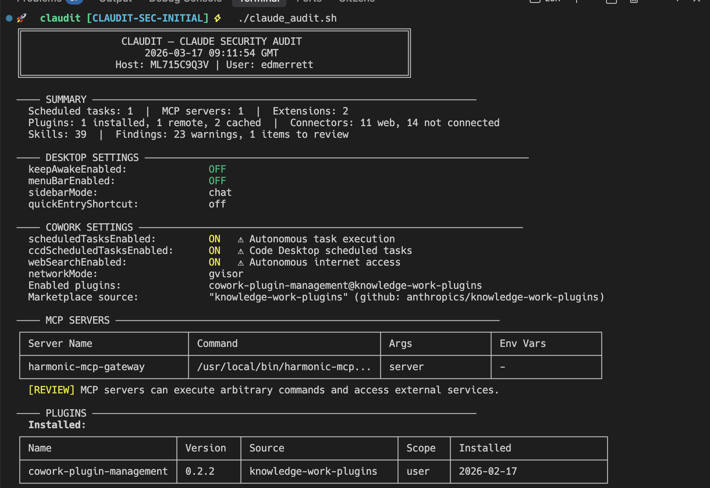
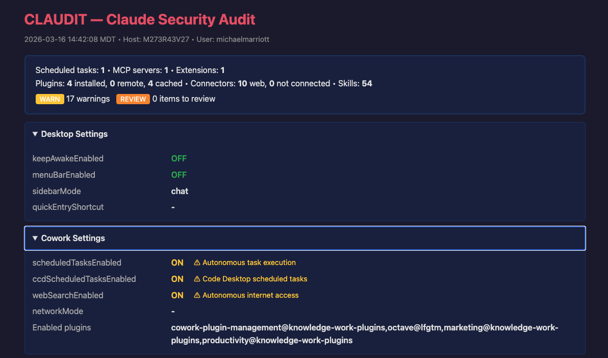

# CLAUDIT-SEC

**Security audit tool for Claude Desktop and Claude Code on macOS.**

A read-only, single-file shell script that inventories Claude AI configuration, autonomous capabilities, extensions, plugins, connectors, MCP servers, scheduled tasks, and file permissions. One command, full visibility.

<p align="center">
  
</p>

## Why

Claude Desktop and Claude Code introduce a new class of endpoint risk: AI agents with autonomous execution, persistent scheduled tasks, MCP server integrations, browser-control extensions, and OAuth-authenticated connectors to external services. Most of this configuration lives in JSON files scattered across multiple directories with no centralised visibility.

CLAUDIT gives you that visibility in a single command.

## What It Audits

| Area | What's Checked |
|------|---------------|
| **Desktop Settings** | `keepAwakeEnabled`, sidebar/menuBar preferences |
| **Cowork Settings** | Scheduled tasks, web search, network mode, enabled plugins, marketplaces |
| **MCP Servers** | Server names, commands, arguments, environment variable keys |
| **Extensions (DXT)** | Installed extensions, signature status, dangerous tool grants |
| **Extension Settings** | Per-extension allowed directories and configuration |
| **Extension Governance** | Allowlist enabled/disabled, blocklist entries |
| **Plugins** | Installed, remote (org-deployed), cached (downloaded) |
| **Connectors** | OAuth-authenticated web services, desktop integrations |
| **Skills** | User-created, scheduled, session-local, and plugin skills across 9 paths |
| **Scheduled Tasks** | Task names, cron expressions (with plain English translation) |
| **App Config** | OAuth token presence, network mode, extension allowlist keys |
| **Claude Code** | `~/.claude/settings.json` permission grants |
| **File Permissions** | `stat()` on all config files, cookies, extension settings |
| **Runtime State** | Running processes, sleep assertions, LaunchAgents, crontab entries |
| **Cookies** | `Cookies` and `Cookies-journal` presence and permissions |

## Prerequisites

You need three things, all of which ship with or are easily installed on any Mac:

| Requirement | How to check | How to install |
|-------------|-------------|---------------|
| **macOS** | You're on a Mac | — |
| **zsh** | `zsh --version` | Ships with macOS since Catalina (10.15) |
| **jq** | `jq --version` | `brew install jq` |

If you don't have Homebrew: `/bin/bash -c "$(curl -fsSL https://raw.githubusercontent.com/Homebrew/install/HEAD/install.sh)"`, then `brew install jq`.

## Getting Started

### Step 1: Download the script

```bash
git clone https://github.com/HarmonicSecurity/claudit-sec.git
cd claudit-sec
```

Or download `claude_audit.sh` directly and place it wherever you like.

### Step 2: Make it executable

```bash
chmod +x claude_audit.sh
```

### Step 3: Run it

```bash
./claude_audit.sh
```

That's it. The script reads your Claude configuration and prints a colour-coded report to the terminal. It does not modify anything.

## Usage

```
./claude_audit.sh [OPTIONS]

Options:
  --html [FILE]    Generate a standalone HTML report
  --json           Output structured JSON
  --user USER      Audit a specific user
  --all-users      Audit all users with Claude data (requires root)
  -q, --quiet      Only show WARN and CRITICAL findings
  --version        Print version and exit
  -h, --help       Show usage
```

### Examples

```bash
# Default: audit current user, colour output in terminal
./claude_audit.sh

# Only show warnings and critical findings (skip the noise)
./claude_audit.sh -q

# Generate a standalone HTML report (opens in any browser)
./claude_audit.sh --html

# HTML report with a specific filename
./claude_audit.sh --html my_audit.html

# JSON output (pipe it wherever you need)
./claude_audit.sh --json

# JSON to a file
./claude_audit.sh --json > audit.json

# Audit a specific user (requires permission to read their home directory)
./claude_audit.sh --user jsmith

# Audit every user on the machine (run as root)
sudo ./claude_audit.sh --all-users
```

### Running as root

When run as root (uid 0), the script automatically discovers and scans all users with Claude data. No flags needed — just `sudo ./claude_audit.sh`. This is useful for fleet-wide deployment via MDM or other endpoint management tools.

## Output Formats

### Terminal (default)

Colour-coded output with Unicode tables and severity indicators.

<p align="center">
  
</p>

### HTML (`--html`)

Standalone dark-themed report with collapsible sections. Created with restrictive file permissions (`0600`). Opens in any browser.

<p align="center">
  
</p>

### JSON (`--json`)

Structured output for programmatic consumption. Sensitive fields (OAuth tokens, API keys, secrets) are automatically redacted. Multi-user scans produce a JSON array.

## Severity Levels

| Severity | Meaning |
|----------|---------|
| **CRITICAL** | Immediate risk — e.g. config files writable by other users |
| **WARN** | Increases risk surface — e.g. unsigned extensions, autonomous execution enabled, plaintext tokens |
| **REVIEW** | Needs human judgement — e.g. org-deployed plugins, MCP servers present |
| **INFO** | No action needed — e.g. Claude is running, permissions granted |

## What to Look For

- **Autonomous execution enabled** — Scheduled tasks run without user interaction. Review what each task does.
- **Unsigned extensions with dangerous tools** — `run_command`, `write_file`, `execute_javascript` in unsigned extensions is the highest-risk combination.
- **Extension allowlist disabled** — Without an allowlist, any extension can be installed without approval.
- **Plaintext OAuth tokens** — Stored in `config.json`, readable by any process running as the user.
- **MCP servers** — Each one is an arbitrary command execution surface.
- **Web connectors** — Each authenticated connector grants Claude access to an external service using your credentials.
- **Insecure file permissions** — Config files readable or writable by other users.

## Security Properties

- **Read-only** — never writes to, modifies, or deletes any audited file
- **No network access** — all data collected from local filesystem and system commands
- **Sensitive data redacted** — tokens, keys, and secrets replaced with `[REDACTED]` in all output formats
- **Minimal privileges** — runs as current user; root only needed for multi-user scans
- **Single file** — no dependencies to worry about (except `jq`)
- **Auditable** — the entire tool is one readable shell script

## License

Apache License 2.0 — see [LICENSE](LICENSE) for details.
